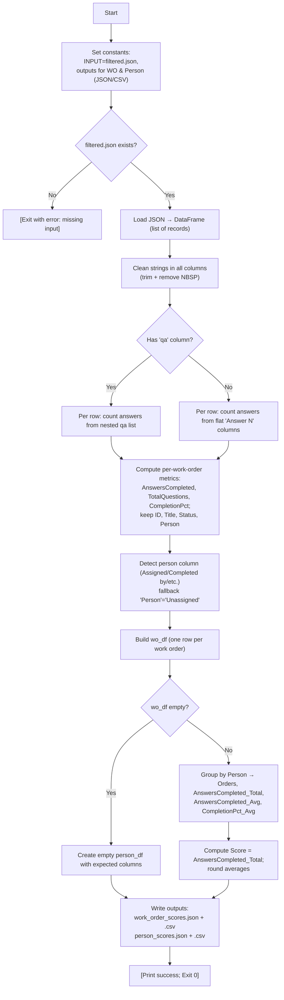
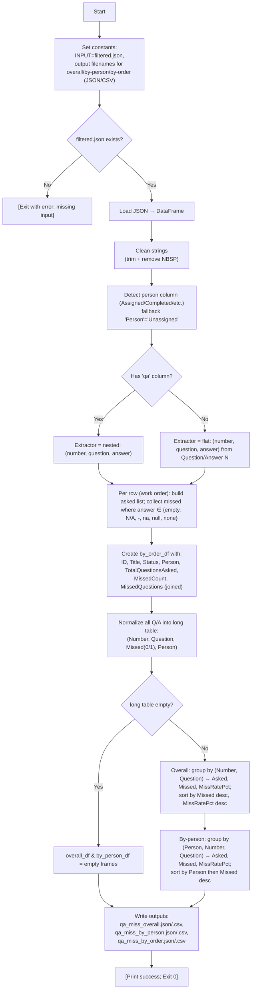

# Program Flow

## Each chart describes the logic of each python script

### filter_work_orders_to_json.py

```mermaid
flowchart TD
    A([Start]) --> B[Parse command line arguments]
    B --> C[Resolve file paths for input output and settings]
    C --> D{Input CSV exists}
    D -- No --> E[Print error and exit]
    E --> Z([End])
    D -- Yes --> F[Load settings JSON]
    F --> G[Build CSV read options from settings]
    G --> H[Read CSV into DataFrame]
    H --> I[Clean whitespace and NBSP]
    I --> J[Count rows in dataset]
    J --> K{Status filter provided}
    K -- Yes --> K1[Keep rows where Status matches]
    K -- No --> L
    K1 --> L
    L --> M{Exclude status filter provided}
    M -- Yes --> M1[Remove rows with that status]
    M -- No --> N
    M1 --> N
    N --> O{Contains filters present}
    O -- No --> P
    O -- Yes --> O1[Loop through each contains rule]
    O1 --> O2[Split rule into column and substring]
    O2 --> O3{Column exists}
    O3 -- No --> O4[Raise error]
    O4 --> Z
    O3 -- Yes --> O5[Filter rows where column contains substring]
    O5 --> O6{More contains rules}
    O6 -- Yes --> O1
    O6 -- No --> P
    P --> Q{Date filtering requested}
    Q -- No --> R
    Q -- Yes --> Q1{Date column exists}
    Q1 -- No --> Q2[Warn and skip date filtering]
    Q2 --> R
    Q1 -- Yes --> Q3[Convert column to datetime]
    Q3 --> Q4[Filter by start date if provided]
    Q4 --> Q5[Filter by end date if provided]
    Q5 --> R
    R --> S{Nest question answer pairs}
    S -- No --> T
    S -- Yes --> S1[Loop through each row]
    S1 --> S2[Loop through each column]
    S2 --> S3{Column begins with Question}
    S3 -- Yes --> S4[Find matching Answer and build QA object]
    S3 -- No --> S5[Continue]
    S4 --> S5
    S5 --> S6{More columns}
    S6 -- Yes --> S2
    S6 -- No --> S7[Attach QA list to row]
    S7 --> T
    T --> U{Keep columns option provided}
    U -- No --> V
    U -- Yes --> U1[Validate requested columns]
    U1 --> U2{Missing columns}
    U2 -- Yes --> U3[Print error and exit]
    U3 --> Z
    U2 -- No --> V
    V --> W{Limit rows}
    W -- Yes --> W1[Keep first N rows]
    W -- No --> X
    W1 --> X
    X --> Y[Print rows in and rows out]
    Y --> AA[Create output folder]
    AA --> AB{QA nesting enabled}
    AB -- Yes --> AC[Loop through rows and convert to dictionaries]
    AB -- No --> AD[Convert DataFrame to JSON records]
    AC --> AE[Write JSON file]
    AD --> AE
    AE --> AF[Print success message]
    AF --> Z([End])
```

# score_from_json_auto.py

```mermaid
flowchart TD
    A[Start] --> B["Set constants:<br/>INPUT=filtered.json,<br/>outputs for WO & Person (JSON/CSV)"]
    B --> C{filtered.json exists?}
    C -- No --> D["[Exit with error: missing input]"]
    C -- Yes --> E["Load JSON → DataFrame (list of records)"]
    E --> F["Clean strings in all columns<br/>(trim + remove NBSP)"]
    F --> G{Has 'qa' column?}
    G -- Yes --> H[Per row: count answers from nested qa list]
    G -- No --> I[Per row: count answers from flat 'Answer N' columns]
    H --> J
    I --> J[Compute per‑work‑order metrics:<br/>AnswersCompleted, TotalQuestions, CompletionPct;<br/>keep ID, Title, Status, Person]
    J --> K["Detect person column (Assigned/Completed by/etc.)<br/>fallback 'Person'='Unassigned'"]
    K --> L["Build wo_df (one row per work order)"]
    L --> M{wo_df empty?}
    M -- Yes --> N[Create empty person_df with expected columns]
    M -- No --> O[Group by Person → Orders, AnswersCompleted_Total,<br/>AnswersCompleted_Avg, CompletionPct_Avg]
    O --> P[Compute Score = AnswersCompleted_Total;<br/>round averages]
    N --> Q
    P --> Q[Write outputs:<br/>work_order_scores.json + .csv<br/>person_scores.json + .csv]
    Q --> R["[Print success; Exit 0]"]
```

## qa_miss_breakdown_auto.py

```mermaid
flowchart TD
    A[Start] --> B["Set constants:<br/>INPUT=filtered.json,<br/>output filenames for overall/by-person/by-order (JSON/CSV)"]
    B --> C{filtered.json exists?}
    C -- No --> D["[Exit with error: missing input]"]
    C -- Yes --> E[Load JSON → DataFrame]
    E --> F["Clean strings<br/>(trim + remove NBSP)"]
    F --> G["Detect person column (Assigned/Completed/etc.)<br/>fallback 'Person'='Unassigned'"]
    G --> H{Has 'qa' column?}
    H -- Yes --> I["Extractor = nested: (number, question, answer)"]
    H -- No --> J["Extractor = flat: (number, question, answer) from Question/Answer N"]
    I --> K
    J --> K["Per row (work order): build asked list; collect missed where answer ∈ {empty, N/A, -, na, null, none}"]
    K --> L["Create by_order_df with:<br/>ID, Title, Status, Person, TotalQuestionsAsked,<br/>MissedCount, MissedQuestions (joined)"]
    L --> M["Normalize all Q/A into long table:<br/>(Number, Question, Missed(0/1), Person)"]
    M --> N{long table empty?}
    N -- Yes --> O[overall_df & by_person_df = empty frames]
    N -- No --> P["Overall: group by (Number, Question) → Asked, Missed, MissRatePct;<br/>sort by Missed desc, MissRatePct desc"]
    P --> Q["By‑person: group by (Person, Number, Question) → Asked, Missed, MissRatePct;<br/>sort by Person then Missed desc"]
    O --> R
    Q --> R[Write outputs:<br/>qa_miss_overall.json/.csv,<br/>qa_miss_by_person.json/.csv,<br/>qa_miss_by_order.json/.csv]
    R --> S["[Print success; Exit 0]"]

```

